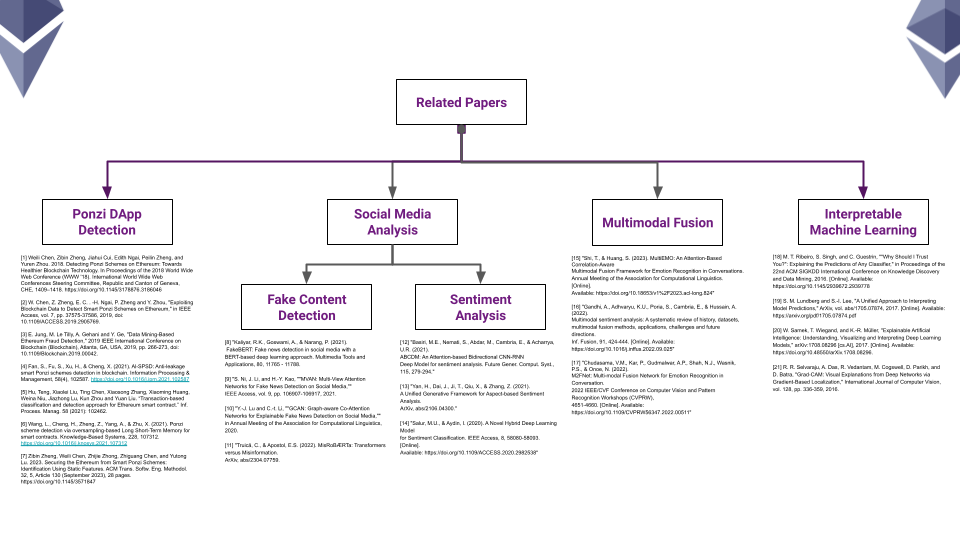
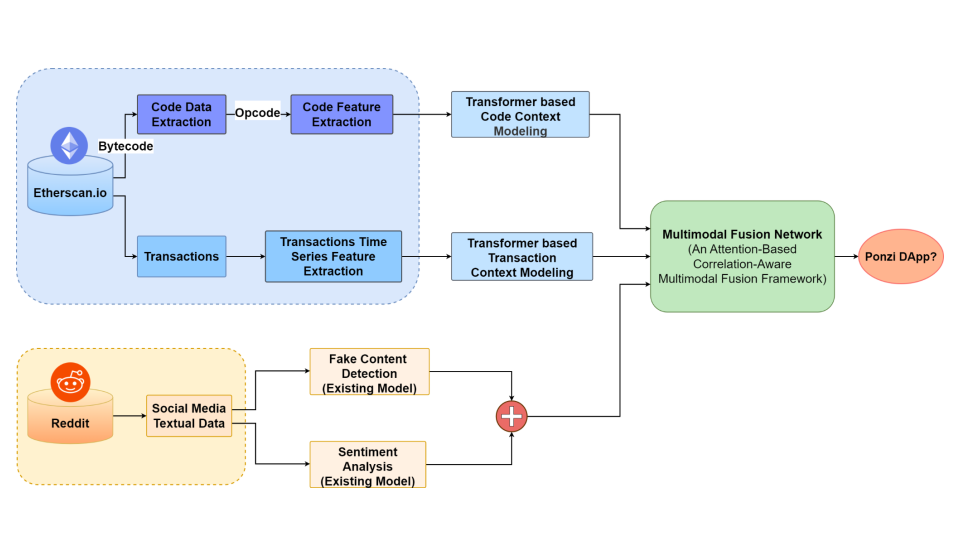

# Ponzi Shield

## A Multimodal Real-time System for Detecting Ponzi DApps

### Authors:
- [Nimsara Fernando](https://github.com/nimsara66)
- [Chamod Madhusanka](https://github.com/chamodmadhusanka)
- [Sandun Induwara](https://github.com/sanduninduwara)

### Supervisors:
- Internal Supervisor: Dr. Sandareka Wickramanayake
- External Supervisor: Dr. Dilum Bandara

## Motivation

Decentralized Applications (DApps) have gained rapid popularity within the industry, leveraging their decentralized nature. However, this popularity has also led to the emergence of fraudulent DApps, including Ponzi schemes and phishing scams. In 2019, scammers stole $4.3 billion from millions of victims, with 92% of the losses attributed to Ponzi schemes [1]. Existing solutions offer methods for classifying Ponzi DApps but fall short in identifying them in real-time during transactions.

## Problem Statement

The challenge is to recognize a Ponzi DApp in real time as it transacts, relying on analysis of its smart contract, transactions, and social media sentiment.

## Objectives

1. Detect ongoing Ponzi schemes in DApps in real-time during transactions.
2. Employ social media sentiment analysis for Ponzi scheme detection.
3. Ensure the reliability of social media sentiment by resisting fake content exploitations.
4. Integrate state-of-the-art fusion techniques to combine smart contract data, transaction records, and social media sentiment for a comprehensive Ponzi schemes detection approach.
5. Provide explainability insights into the decision-making process of the Ponzi scheme detection model, ensuring transparency and interpretability in its results.

## Related Work

## Proposed System

## Smart Contract Branch

[Smartcode Extraction](https://github.com/PonziShield/code-extraction)

## Transacton Branch

[Transacton Data Extraction](https://github.com/PonziShield/test_data_extraction)

## Social Sentiment Branch

[Dapp & Social Media Info Extract](https://github.com/PonziShield/DappInfoExtract)

## Multimodal Fusion

## [Proposal Presentation](./assets/proposal_presentation.pdf)

## References

[1] S. Fan, S. Fu, H. Xu, and X. Cheng, "Al-SPSD: Anti-leakage smart Ponzi schemes detection in blockchain," Information Processing & Management, vol. 58, no. 4, pp. 102587, 2021. [Online]. Available: DOI link.  
[2] Weili Chen, Zibin Zheng, Jiahui Cui, Edith Ngai, Peilin Zheng, and Yuren Zhou. 2018. Detecting Ponzi Schemes on Ethereum: Towards Healthier Blockchain Technology. In Proceedings of the 2018 World Wide Web Conference (WWW '18). International World Wide Web Conferences Steering Committee, Republic and Canton of Geneva, CHE, 1409–1418. https://doi.org/10.1145/3178876.3186046.  
[3] W. Chen, Z. Zheng, E. C. . -H. Ngai, P. Zheng and Y. Zhou, "Exploiting Blockchain Data to Detect Smart Ponzi Schemes on Ethereum," in IEEE Access, vol. 7, pp. 37575-37586, 2019, doi: 10.1109/ACCESS.2019.2905769.  
[4] Fan, S., Fu, S., Xu, H., & Cheng, X. (2021). Al-SPSD: Anti-leakage smart Ponzi schemes detection in blockchain. Information Processing & Management, 58(4), 102587. https://doi.org/10.1016/j.ipm.2021.102587.  
[5] Wang, L., Cheng, H., Zheng, Z., Yang, A., & Zhu, X. (2021). Ponzi scheme detection via oversampling-based Long Short-Term Memory for smart contracts. Knowledge-Based Systems, 228, 107312. https://doi.org/10.1016/j.knosys.2021.107312.  
[6] E. Jung, M. Le Tilly, A. Gehani and Y. Ge, "Data Mining-Based Ethereum Fraud Detection," 2019 IEEE International Conference on Blockchain (Blockchain), Atlanta, GA, USA, 2019, pp. 266-273, doi: 10.1109/Blockchain.2019.00042.  
[7] Teng Hu, Xiaolei Liu, Ting Chen, Xiaosong Zhang, Xiaoming Huang, Weina Niu, Jiazhong Lu, Kun Zhou, Yuan Liu, Transaction-based classification and detection approach for Ethereum smart contract, Information Processing & Management, https://doi.org/10.1016/j.ipm.2020.102462.  
[8] Zibin Zheng, Weili Chen, Zhijie Zhong, Zhiguang Chen, and Yutong Lu. 2023. Securing the Ethereum from Smart Ponzi Schemes: Identification Using Static Features. ACM Trans. Softw. Eng. Methodol. 32, 5, Article 130 (September 2023), 28 pages. https://doi.org/10.1145/3571847  
